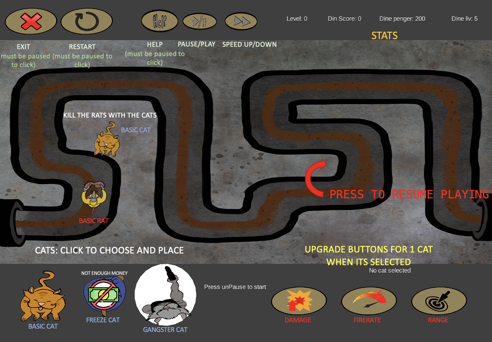

# *Skadedyrkontrollørene INC, Return of the Rats*

### About the game
In this strategy game, the goal is to defend the city from a rat invasion using various types of cats placed along the rats' invasion route. The game takes place in a two-dimensional world, down in the sewers, where players can deploy the cats around the pipe that the rats crawl through.

#### Gameplay 

#### Game Start Screen

#### Help Screen

### Downloand 
[Download your JAR file](https://drive.google.com/file/d/1ho357NHOq8r9taI_JZjNUNLgtulkwpOt/view?usp=sharing)

### How to play
When you start the game, you are greeted by a homepage. Here, you can either open the help menu by pressing "help," or go straight to game mode by pressing "Play." After pressing play, you can place cats. You do this by pressing on the cat you want to choose, and then pressing on the map. Next, press the "play/pause" button to start the game. Then the rats will come, and if you think it's going too slowly, you can press the "fast-forward" button, which is located next to the play/pause button. When the rats are killed, the round is over. To upgrade the cats, you can press on one of the cats you have placed on the map, and then press one of the three icons located along the bottom line on the right side. These upgrade fire rate, range, and damage. At the top right of the screen, you can see an overview of your statistics. If you need help, you can press the "help" button. This will display the help menu, and you can continue playing after you have finished viewing it. If you want to start over, you can press the "restart" button, and if you want to quit, you press the "x" button.

